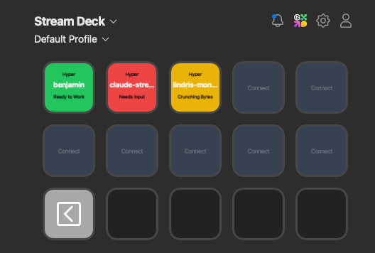

# Claude Code Stream Deck Plugin

Display your Claude Code session status on your Stream Deck. Shows which app Claude is running in, the project name, and current status with color-coded buttons.



## Button States

- **Green** - Ready to Work (Claude is idle, waiting for input)
- **Yellow** - Crunching Bytes (Claude is working)
- **Red** - Needs Input (Claude needs permission or is waiting)
- **Gray** - Connect Claude (no active session on this button)

## Features

- Shows the terminal/IDE app name (Hyper, Cursor, VS Code, iTerm2, Warp, Alacritty, kitty, Zed, Terminal)
- Shows the project directory name
- Plays a sound when Claude needs input
- Click a button to focus that app
- Buttons are assigned in order (top-left to bottom-right)
- Automatic orphan cleanup — if a session dies without a clean exit, the button resets within 5 seconds

## Requirements

- macOS 10.15 or later
- Stream Deck software 6.9 or later
- Claude Code CLI installed
- `jq` installed (`brew install jq`)

## Installation

### Step 1: Install the Stream Deck Plugin

Download the latest `com.claude.status.streamDeckPlugin` from [Releases](https://github.com/benjaminprojas/claude-streamdeck-plugin/releases) and double-click to install, or build from source (see below).

### Step 2: Install the Hook Script

```bash
mkdir -p ~/.claude/hooks
cp dist/streamdeck-status.sh ~/.claude/hooks/
chmod +x ~/.claude/hooks/streamdeck-status.sh
```

### Step 3: Configure Claude Code Hooks

Add the following to your `~/.claude/settings.json` file. If the file doesn't exist, create it:

```json
{
  "hooks": {
    "SessionStart": [
      { "hooks": [{ "type": "command", "command": "~/.claude/hooks/streamdeck-status.sh" }] }
    ],
    "SessionEnd": [
      { "hooks": [{ "type": "command", "command": "~/.claude/hooks/streamdeck-status.sh" }] }
    ],
    "UserPromptSubmit": [
      { "hooks": [{ "type": "command", "command": "~/.claude/hooks/streamdeck-status.sh" }] }
    ],
    "PreToolUse": [
      { "hooks": [{ "type": "command", "command": "~/.claude/hooks/streamdeck-status.sh" }] }
    ],
    "PostToolUse": [
      { "hooks": [{ "type": "command", "command": "~/.claude/hooks/streamdeck-status.sh" }] }
    ],
    "Stop": [
      { "hooks": [{ "type": "command", "command": "~/.claude/hooks/streamdeck-status.sh" }] }
    ],
    "Notification": [
      { "hooks": [{ "type": "command", "command": "~/.claude/hooks/streamdeck-status.sh" }] }
    ]
  }
}
```

If you already have a `settings.json` with other settings, merge the hooks section.

### Step 4: Add Buttons to Stream Deck

1. Open Stream Deck software
2. Find "Claude Code" in the actions list on the right
3. Drag "Claude Status" buttons onto your Stream Deck
4. Add as many buttons as you want (sessions will be assigned in order)

## Usage

1. Start a Claude Code session in any terminal or IDE
2. The first available Stream Deck button will show your session
3. The button displays:
   - **Top:** App name (e.g., "Hyper")
   - **Middle:** Project name (e.g., "my-project")
   - **Bottom:** Status (e.g., "Ready to Work")
4. Click a button to focus that app
5. When Claude needs input, the button turns red and plays a sound

## Building from Source

### Prerequisites

- Node.js 20+
- npm

### Build

```bash
npm install
npm run build
```

This compiles `src/plugin.ts` into `com.claude.status.sdPlugin/bin/plugin.js` via Rollup.

### Development

```bash
npm run watch
```

Watches for changes and rebuilds automatically.

### Project Structure

```
src/
  plugin.ts              # Main plugin source (TypeScript)
dist/
  streamdeck-status.sh   # Claude Code hook script
  README.md              # Standalone installation guide
com.claude.status.sdPlugin/
  manifest.json          # Stream Deck plugin manifest
  bin/                   # Build output (gitignored)
  imgs/                  # Plugin icons and button images
  logs/                  # Runtime logs (gitignored)
rollup.config.mjs        # Rollup build configuration
tsconfig.json             # TypeScript configuration
```

### Architecture

The plugin has two components:

1. **Hook script** (`streamdeck-status.sh`) — Runs on every Claude Code lifecycle event. Detects the parent terminal/IDE app and the Claude process PID on session start, then sends status updates via HTTP POST to the plugin.

2. **Stream Deck plugin** (`plugin.ts`) — Runs inside Stream Deck's Node.js runtime. Listens for status updates on `http://127.0.0.1:31548/status`, manages button assignments, renders SVG button images, and runs a 5-second liveness check to clean up orphaned sessions.

## Customization

### Change the Alert Sound

Edit the sound file path in `src/plugin.ts`. Available macOS sounds:
- `/System/Library/Sounds/Funk.aiff` (default)
- `/System/Library/Sounds/Glass.aiff`
- `/System/Library/Sounds/Ping.aiff`
- `/System/Library/Sounds/Pop.aiff`
- And more in `/System/Library/Sounds/`

### Add Support for Other Terminal Apps

Edit the `detect_parent_app()` function in `dist/streamdeck-status.sh` to add more app patterns.

## Troubleshooting

### Buttons not updating
- Make sure the hook script is executable: `chmod +x ~/.claude/hooks/streamdeck-status.sh`
- Check that `jq` is installed: `brew install jq`
- Verify hooks are configured in `~/.claude/settings.json`

### Wrong app detected
- The app is detected on session start; restart Claude to re-detect
- Add your terminal app to the detection list in `streamdeck-status.sh`

### Sessions stuck on buttons
- The orphan checker should clean these up within 5 seconds
- Check plugin logs in `com.claude.status.sdPlugin/logs/` for errors
- Restart Stream Deck software if needed

## License

MIT
